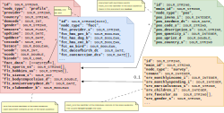

#### [Project Overview](../README.md)
----

# Mapping a document landscape

This article shows how to map your documents, so they can be queried using Audlang expressions. 

- [A simple mapping](#a-simple-mapping)
    - [Example 1](#example-1)
    - [Example 2](#example-2)
- [Adding the facts](#adding-the-facts)
    - [Example 3](#example-3)
    - [Example 4](#example-4)
    - [Example 5](#example-5)
- [Adding POS data](#adding-pos-data)
    - [Example 6](#example-6)
- [Adding survey data](#adding-survey-data)
    - [Example 7](#example-7)
- [Adding more fields](#adding-more-fields)
    - [Example 8](#example-8)
- [Further Reading](#further-reading)


Below, I use the same documents I use for the unit-tests against the embedded Solr during the build process. 



Here you can review the full data: [audlang-data-hybrid.json](../src/test/resources/solr/exampledocs/audlang-data-hybrid.json).

All documentation examples can be found here: [SolrDocumentationTest](../src/test/java/de/calamanari/adl/solr/cnv/SolrDocumentationTest.java).

To keep the examples short I assume the following static imports for all examples below:
```java
import static de.calamanari.adl.cnv.tps.DefaultAdlType.BOOL;
import static de.calamanari.adl.cnv.tps.DefaultAdlType.DATE;
import static de.calamanari.adl.cnv.tps.DefaultAdlType.DECIMAL;
import static de.calamanari.adl.cnv.tps.DefaultAdlType.INTEGER;
import static de.calamanari.adl.cnv.tps.DefaultAdlType.STRING;
import static de.calamanari.adl.solr.DefaultAdlSolrType.SOLR_INTEGER;
import static de.calamanari.adl.solr.DefaultAdlSolrType.SOLR_BOOLEAN;
import static de.calamanari.adl.solr.DefaultAdlSolrType.SOLR_DATE;
import static de.calamanari.adl.solr.DefaultAdlSolrType.SOLR_DOUBLE;
import static de.calamanari.adl.solr.DefaultAdlSolrType.SOLR_FLOAT;
import static de.calamanari.adl.solr.DefaultAdlSolrType.SOLR_LONG;
import static de.calamanari.adl.solr.DefaultAdlSolrType.SOLR_STRING;
```

## A simple mapping

Let's assume there is only the main document of node type `profile` holding the base audience.


This is a trivial mapping case because all attributes sit in fields of the same document side-by-side and `id` is the unique key, so each record of your base audience can only appear once.

### Example 1
A first mapping could look as follows:

```java
SolrMappingConfig mappingConfig
 = MainDocumentConfig.forNodeType("profile")
    .dataField("provider", SOLR_STRING).mappedToArgName("provider", STRING)
    .dataField("country", SOLR_STRING).mappedToArgName("home-country")
    .dataField("city", SOLR_STRING).mappedToArgName("home-city")
    .dataField("demcode", SOLR_INTEGER).mappedToArgName("demCode")
    .dataField("gender", SOLR_STRING).mappedToArgName("gender")
    .dataField("omscore", SOLR_FLOAT).mappedToArgName("omScore")
.get();


```

*Notes:*
 * We do not need to map all columns, we can concentrate on the relevant ones.
 * Columns are defined and assigned to arguments of the logical data model. Both sides have types related to their "world".
 * The mapping above assumes that we don't have yet a logical data model. Alternatively, you can setup a logical model ([ArgMetaInfoLookup](https://github.com/KarlEilebrecht/audlang-java-core/tree/main/src/main/java/de/calamanari/adl/cnv/tps#readme)) *beforehand* and specify it initially. In this case you should omit the types on the right and concentrate on the Solr-types on the left. See [MainDocumentConfigTest](../src/test/java/de/calamanari/adl/solr/config/MainDocumentConfigTest.java).
 * We can but we don't have to repeat the type of the mapped Audlang argument if it can be
   resolved from the Solr-field type.

The expression `provider = LOGMOTH AND home-country = USA` produces:
```sql
node_type:profile
AND country:USA

node_type:profile
AND provider:LOGMOTH
```
:bulb: **Note:** These are **two filter queries** for a single job. Solr will intersect them when running the execution. This allows for independent result caching.

The expression `(provider = LOGMOTH AND home-country = USA) OR omScore > 5000` produces:
```sql
node_type:profile
AND (
    (
        country:USA
        AND provider:LOGMOTH
    )
    OR omscore:{5000.0 TO *]
)
```

:bulb: **Note:** Because the root is a logical `OR`, this time we get a **single filter query**.

:bulb: The [type-coalescence](type-coalescence.md) automatically aligns 5000 to decimal.


### Example 2

```java
SolrMappingConfig mappingConfig
= MainDocumentConfig.forNodeType("profile")
    .dataField("provider", SOLR_STRING).mappedToArgName("provider")
    .dataField("country", SOLR_STRING).mappedToArgName("home-country")
    .dataField("city", SOLR_STRING).mappedToArgName("home-city")
    .dataField("demcode", SOLR_INTEGER).mappedToArgName("demCode")
    .dataField("gender", SOLR_STRING).mappedToArgName("gender")
    .dataField("omscore", SOLR_FLOAT).mappedToArgName("omScore")
    .dataField("updtime", SOLR_DATE).mappedToArgName("upd1")
    .dataField("upddate", SOLR_DATE).mappedToArgName("upd2")
.get();
```

This time we map two additional columns, both of type Solr-DATE. `updtime` is a timestamp and `upddate` is a date (time portion `00:00:00Z`). By convention in Audlang we do not deal with time, so we must map both to type DATE.

The expression `provider = LOGMOTH AND upd1 = 2024-09-24 AND upd2 = 2024-09-24` produces three filter queries to be intersected by Solr:

```sql
node_type:profile
AND provider:LOGMOTH

node_type:profile
AND upddate:[2024\-09\-24T00\:00\:00Z TO 2024\-09\-25T00\:00\:00Z}

node_type:profile
AND updtime:[2024\-09\-24T00\:00\:00Z TO 2024\-09\-25T00\:00\:00Z}
```
:bulb: Here the advanced [type-coalescence](type-coalescence.md) detected that the underlying fields have a finer type resolution and created a range query.

Automatic DATE adjustments also works for reference matches: `provider = LOGMOTH AND upd1 = @upd2`.

```sql
node_type:profile
AND _query_:"\{\!frange\ l=1\ u=1\}if\(and\(\
\   \   \   \   exists\(updtime\),exists\(upddate\),\
\   \   \   \   eq\(sub\(ms\(updtime\),sub\(ms\(updtime\),\
\   \   \   \   \   \   mul\(floor\(div\(ms\(updtime\),86400000\)\),86400000\)\)\),\
\   \   \   \   \   sub\(ms\(upddate\),sub\(ms\(upddate\),\
\   \   \   \   \   \   mul\(floor\(div\(ms\(upddate\),86400000\)\),86400000\)\)\)\)\)\
\   \   \   \   ,1,0\)"

node_type:profile
AND provider:LOGMOTH
```

## Adding the facts

One document, all attributes side-by-side is the recommended storage form, but sometimes you want to maintain them in multiple documents. Let's add the facts as **nested documents**, one per each fact.


This document mimics **key-value semantics**. Each member of your base audience can have as many facts as you like, even multiple entries for the same fact are possible. The document has a different node type `fact` to distinguish these documents from the main documents. Because it is nested, its relation to the main document is implicitly maintained by Solr. Technically, all documents sit side-by-side with the main document.

### Example 3

Let's start with the two boolean facts `hasCat` and `hasBird`:

```java
SolrMappingConfig mappingConfig
= MainDocumentConfig.forNodeType("profile")
    [...]
    .subConfig(SubDocumentConfig.forNodeType("fact")
        .nested()
        .dataField("fct_provider_s").mappedToArgName("fact.provider")
        .dataField("fct_hascat_b", SOLR_BOOLEAN).mappedToArgName("fact.hasCat")
        .dataField("fct_hasbird_b").mappedToArgName("fact.hasBird")
    .get())
.get();
```

That seems to be ok at first glance:

The query `fact.provider = CLCPRO AND (fact.hasCat.flg=1 OR fact.hasBird.flg=1)` translates to:

```sql
node_type:profile
AND {!parent which="node_type:profile" v="node_type\:fact\
\   AND\ \(\
\   \ \ \ \ fct_hasbird_b\:TRUE\
\   \ \ \ \ OR\ fct_hascat_b\:TRUE\
\   \)\
\   AND\ fct_provider_s\:CLCPRO"}
```

However, the query `fact.provider = CLCPRO AND fact.hasCat.flg=1 AND fact.hasBird.flg=1` does not return any result, although `19014` has indeed a bird and a cat.

*What went wrong?*

Let's look at the query:

```sql
node_type:profile
AND {!parent which="node_type:profile" v="node_type\:fact\
\   AND\ fct_hasbird_b\:TRUE\
\   AND\ fct_hascat_b\:TRUE\
\   AND\ fct_provider_s\:CLCPRO"}
```

The first condition (hasCat) *pins* the document, so the second condition (hasBird) cannot be met anymore.

The cause is called **[:point_right: multi-doc problem](./multi-doc-concept.md)** and requires additional meta-data so the query-builder will create a correct query.

```java
SolrMappingConfig mappingConfig
= MainDocumentConfig.forNodeType("profile")
    [...]
    .subConfig(SubDocumentConfig.forNodeType("fact")
        .nested()
        .dataField("fct_provider_s").mappedToArgName("fact.provider")
        .dataField("fct_hascat_b", SOLR_BOOLEAN)
            .mappedToArgName("fact.hasCat").multiDoc()
        .dataField("fct_hasbird_b")
            .mappedToArgName("fact.hasBird").multiDoc()
    .get())
.get();
```

Now, the query `fact.provider = CLCPRO AND fact.hasCat.flg=1 AND fact.hasBird.flg=1` returns `19014` as expected.

```sql
node_type:profile
AND {!parent which="node_type:profile" v="node_type\:fact\
\   AND\ fct_provider_s\:CLCPRO"}
AND {!parent which="node_type:profile" v="node_type\:fact\
\   AND\ fct_hasbird_b\:TRUE"}
AND {!parent which="node_type:profile" v="node_type\:fact\
\   AND\ fct_hascat_b\:TRUE"}
```


Now, let's map the entire facts:

```java
SolrMappingConfig mappingConfig
= MainDocumentConfig.forNodeType("profile")
    [...]
    .subConfig(
        SubDocumentConfig.forNodeType("fact")
            .nestedMultiDoc()
            .dataField("fct_provider_s")
                .mappedToArgName("fact.provider").notMultiDoc()
            .dataField("fct_contacttime_dts", SOLR_DATE)
                .mappedToArgName("fact.contactTime.ts", DATE)
            .dataField("fct_contacttime2_dts", SOLR_DATE)
                .mappedToArgName("fact.contactTime2.dt", DATE)
            .dataField("fct_contactcode_ss", SOLR_STRING)
                .mappedToArgName("fact.contactCode.str", STRING)
            .autoMapped(
                s-> (s.startsWith("fact.") && s.endsWith(".str") && s.length() > 9) ? 
                "fct_" + s.substring(5, s.length()-4).toLowerCase()+"_s" : null)
            .autoMapped(
                s-> (s.startsWith("fact.") && s.endsWith(".int") && s.length() > 9) ? 
                "fct_" + s.substring(5, s.length()-4).toLowerCase()+"_i" : null)
            .autoMapped(
                s-> (s.startsWith("fact.") && s.endsWith(".dec") && s.length() > 9) ? 
                "fct_" + s.substring(5, s.length()-4).toLowerCase()+"_d" : null)
            .autoMapped(
                s-> (s.startsWith("fact.") && s.endsWith(".flg") && s.length() > 9) ? 
                "fct_" + s.substring(5, s.length()-4).toLowerCase()+"_b" : null)
            .autoMapped(
                s-> (s.startsWith("fact.") && s.endsWith(".dt") && s.length() > 8) ? 
                "fct_" + s.substring(5, s.length()-3).toLowerCase()+"_dt" : null)
            .autoMapped(
                s-> (s.startsWith("fact.") && s.endsWith(".ts") && s.length() > 8) ? 
                "fct_" + s.substring(5, s.length()-3).toLowerCase()+"_dt" : null)
            .autoMapped(
                s-> (s.startsWith("fact.") && s.endsWith(".flgs") && s.length() > 8) ? 
                "fct_" + s.substring(5, s.length()-5).toLowerCase()+"_bs" : null)
        .get())
.get();

```

*Notes:*
 * To reduce effort, I have decided to mark all facts as *multi-doc* by starting the sub-configuration with `.nestedMultiDoc()`. Only for the `fact.provider` attribute we don't like that. Thus it is mapping is marked `.notMultiDoc()`. Without doing this we could run into issues if there are multiple sets of facts provided by different providers.
 * Above, you see the **auto-mapping** feature, so you don't have to map each fact explicitly. It works rule-based. If the fact identifier has a certain format it will automatically be mapped to the corresponding field. The given function returns the Solr field name. Types - if not specified explicitly - will be resolved *bottom-up* by applying the Solr dynamic field naming conventions. See **[Supported Solr-types](./solr-types.md)**.
 * You can combine explicit mapping with auto-mapping as long as you consider some rules:
    * You can map the same field to two different `argName`s, but you should do that only in special cases as it can impede expression optimization or cause confusion.
    * You cannot map the same `argName` twice.
    * The sub-configurations' auto-mappers **take precedence** over the main configuration's mappers. In other words: the main configuration comes *last* after processing the sub-configurations in order of configuration.
    * An error will be thrown if you define an auto-mapping rule that would *steal* any explicitly mapped `argName`.

### Example 4

With the previously created mapping we can now query *across* documents:

The expression `home-country=Germany AND fact.hasPet.flg=1` translates to 2 filter queries to be intersected by Solr:

```sql
node_type:profile
AND country:Germany

node_type:profile
AND {!parent which="node_type:profile" v="node_type\:fact\
\   AND\ fct_haspet_b\:TRUE"}
```
The expression `home-country=Germany OR fact.hasPet.flg=1` translates to:

```sql
node_type:profile
AND (
    country:Germany
    OR {!parent which="node_type:profile" v="node_type\:fact\
\   \ \ \ \ AND\ fct_haspet_b\:TRUE"}
)
```
We can also query two facts because we have marked the assignment *multi-doc*.

The expression `home-country=Germany AND fact.hasPet.flg=1 AND fact.hasBird.flg=1` translates to 3 filter queries to be intersected by Solr:

```sql
node_type:profile
AND country:Germany

node_type:profile
AND {!parent which="node_type:profile" v="node_type\:fact\
\   AND\ fct_hasbird_b\:TRUE"}

node_type:profile
AND {!parent which="node_type:profile" v="node_type\:fact\
\   AND\ fct_haspet_b\:TRUE"}
```
The expression `home-country=Germany OR fact.hasPet.flg=1 OR fact.hasBird.flg=1` shows that even in the *multi-doc* case often conditions can be safely included in the same join:

```sql
node_type:profile
AND (
    country:Germany
    OR {!parent which="node_type:profile" v="node_type\:fact\
\   \ \ \ \ AND\ \(\
\   \ \ \ \ \ \ \ \ fct_hasbird_b\:TRUE\
\   \ \ \ \ \ \ \ \ OR\ fct_haspet_b\:TRUE\
\   \ \ \ \ \)"}
)
```

:warning: **No reference matching across documents**: It is not possible to compare two fields from different documents against each other. So, the query `fact.provider = @provider` will result in an error because the field `provider` sits on the main document while `fct_provider_s` sits on the nested document. The only exception to this rule are boolean values because all boolean reference matches get resolved into value-matches during the conversion.

The expression `fact.hasCat.flg!=@fact.hasDog.flg`  (semantically *"has a cat but no dog or vice-versa"*) gets translated to:

```sql
node_type:profile
AND (
    (
        {!parent which="node_type:profile" v="node_type\:fact\
\   \ \ \ \ \ \ \ \ AND\ fct_hascat_b\:FALSE"}
    AND {!parent which="node_type:profile" v="node_type\:fact\
\   \ \ \ \ \ \ \ \ AND\ fct_hasdog_b\:TRUE"}
    AND NOT {!parent which="node_type:profile" v="node_type\:fact\
\   \ \ \ \ \ \ \ \ AND\ fct_hascat_b\:TRUE"}
\       )
    OR (
        {!parent which="node_type:profile" v="node_type\:fact\
\   \ \ \ \ \ \ \ \ AND\ fct_hascat_b\:TRUE"}
        AND {!parent which="node_type:profile" v="node_type\:fact\
\   \ \ \ \ \ \ \ \ AND\ fct_hasdog_b\:FALSE"}
        AND NOT {!parent which="node_type:profile" v="node_type\:fact\
\   \ \ \ \ \ \ \ \ AND\ fct_hasdog_b\:TRUE"}
    )
)
```

See also **[:point_right:About the nature of documents and fields](document-field-nature.md)**.

### Example 5

Based on the previously created setup, the expression `fact.contactTime.ts < 2024-09-01 AND fact.hasPet.flg=1` translates to:

```sql
node_type:profile
AND {!parent which="node_type:profile" v="node_type\:fact\
\   AND\ fct_contacttime_dts\:\[\*\ TO\ 2024\\\-09\\\-01T00\\\:00\\\:00Z\}"}

node_type:profile
AND {!parent which="node_type:profile" v="node_type\:fact\
\   AND\ fct_haspet_b\:TRUE"}
```

*Notes:*
 * We get two filter queries to be intersected by Solr.
 * Keep in mind that `contactTime` is a *collection attribute*, see also [§7 Audlang Spec](https://github.com/KarlEilebrecht/audlang-spec/blob/main/doc/AudienceDefinitionLanguageSpecification.md#7-audlang-and-collection-attributes).

The expression `fact.contactTime.ts > 2024-11-13 OR fact.hasPet.flg=1` on the other hand is simpler because it can be expressed with a single join:

```sql
node_type:profile
AND {!parent which="node_type:profile" v="node_type\:fact\
\   AND\ \(\
\   \ \ \ \ fct_contacttime_dts\:\[2024\\\-11\\\-14T00\\\:00\\\:00Z\ TO\ \*\]\
\   \ \ \ \ OR\ fct_haspet_b\:TRUE\
\   \)"}
```

*Notes:*
 * The [type-coalescence](type-coalescence.md) has detected that the underlying data type has a finer resolution and adjusted the condition on the `contactTime` attribute (Solr range query).

## Adding POS data


This document is interesting because it can contain *multiple rows* per individual (record in the base audience), and the fields in this document are *related*.


```java
SolrMappingConfig mappingConfig
= MainDocumentConfig.forNodeType("profile")
    [...]
    .subConfig(
        .dependent()
        .dataField("pos_invdate_dt").mappedToArgName("pos.date")
        .dataField("pos_description_s").mappedToArgName("pos.name")
        .dataField("pos_quantity_i").mappedToArgName("pos.quantity")
        .dataField("pos_uprice_d").mappedToArgName("pos.unitPrice")
        .dataField("pos_country_s").mappedToArgName("pos.country")
    .get())
.get();

```
*Notes:*
 * This sub-document is marked *dependent*, hence the documents exist independently.
 * Again, all type information gets derived by applying the Solr dynamic field naming conventions.

### Example 6

The expression `home-country=Germany AND pos.date > 2024-04-01` asks for *"anybody from Germany who bought anything after first of April, 2024"*. 
As expected it translates to two filter queries to be executed by Solr:

```sql
node_type:profile
AND country:Germany

node_type:profile
AND {!join from=main_id to=id v="node_type\:pos\
\   AND\ pos_invdate_dt\:\[2024\\\-04\\\-02T00\\\:00\\\:00Z\ TO\ \*\]"}
```

If we eliminate the home-country condition and query `pos.date > 2024-04-01`, the query gets even simpler.

```sql
{!join from=main_id to=id v="node_type\:pos\
\   AND\ pos_invdate_dt\:\[2024\\\-04\\\-02T00\\\:00\\\:00Z\ TO\ \*\]"}
```

On the other hand, if we query the opposite of the first query, namely `NOT (home-country=Germany AND pos.date > 2024-04-01)`, the related Solr query turns into:

```sql
node_type:profile
AND (
    (
        node_type:profile
        AND NOT country:Germany
    )
    OR (
        node_type:profile
        AND NOT {!join from=main_id to=id v="node_type\:pos\
\ \ \ \ \ \ AND\ pos_invdate_dt\:\[2024\\\-04\\\-02T00\\\:00\\\:00Z\ TO\ \*\]"}
    )
)
```

*What can we do if the user is interested in **any** invoice date?*

This is a bit tricky. The question *"Any purchase on a given date **and** some other condition"* can be interpreted in two ways:
 1. *some other condition* must be met *on this purchase event*
 2. *some other condition* is unrelated

As long as *some other condition* sits in a different document, it is always case (2). But if *some other condition* involves further fields of the `pos`-document, it would be case (1)!

You might be tempted to mark the mapping for `pos_invdate_dt` as multi-row to allow the queries like `pos.date = 2024-04-01 AND pos.date = 2024-04-02`. However, this would cause more problems than it solves because it *logically detaches* the attribute from its document-context. 

Instead you can **map the field `pos_invdate_dt` twice**:

```java
SolrMappingConfig mappingConfig
= MainDocumentConfig.forNodeType("profile")
    [...]
    .subConfig(
        .dependent()
        .dataField("pos_invdate_dt").mappedToArgName("pos.date")
        .dataField("pos_invdate_dt")
                .mappedToArgName("pos.anyDate").multiDoc()
        .dataField("pos_description_s").mappedToArgName("pos.name")
        .dataField("pos_quantity_i").mappedToArgName("pos.quantity")
        .dataField("pos_uprice_d").mappedToArgName("pos.unitPrice")
        .dataField("pos_country_s").mappedToArgName("pos.country")
    .get())
.get();

```
The name `anyDate` also makes it clear that this is a special field.

The query `pos.name = CORNFLAKES AND pos.date=2024-03-15 AND pos.anyDate=2024-03-14` asks for *"anybody who bought cornflakes on March 15 *and* anything on March 14"*.

```sql
node_type:profile
AND {!join from=main_id to=id v="node_type\:pos\
\   AND\ pos_invdate_dt\:\[2024\\\-03\\\-15T00\\\:00\\\:00Z\ TO\ 2024\\\-03\\\-16T00\\\:00\\\:00Z\}\
\   AND\ pos_description_s\:CORNFLAKES"}
AND {!join from=main_id to=id v="node_type\:pos\
\   AND\ pos_invdate_dt\:\[2024\\\-03\\\-14T00\\\:00\\\:00Z\ TO\ 2024\\\-03\\\-15T00\\\:00\\\:00Z\}"}

```

Further information related to this topic can be found here **[:point_right: About multi-doc](./multi-doc-concept.md)**.

## Adding survey data


The `survey` document is technically very similar to the table `facts`, but a *dependent* document. The document has been added to the landscape to demonstrate **document filters**.

Here, we assume that the surveys belong to some *tenant*. We further assume that the *tenant* information cannot be influenced by the user and is thus not part of the expression. Instead, it comes from the current execution context or configuration. Nevertheless, the system must ensure that only `survey`- documents will be considered if the field `tenant` contains the *the current tenant* (here `17`).

```java
SolrMappingConfig mappingConfig
= MainDocumentConfig.forNodeType("profile")
    [...]
    .subConfig(
        SubDocumentConfig.forNodeType("survey")
            .dependent()
            .filteredBy("tenant", SOLR_INTEGER, "${tenant}")
            .dataField("srv_favcolor_ss")
                .mappedToArgName("q.favColor.str")
            .autoMapped(s-> (
                s.startsWith("q.") && s.endsWith(".str") && s.length() > 6) ? "srv_" +s.substring(2, s.length()-4).toLowerCase() + "_s" : null)
            .autoMapped(
                s-> (s.startsWith("q.") && s.endsWith(".int") && s.length() > 6) ? "srv_" +s.substring(2, s.length()-4).toLowerCase() + "_i" : null)
            .autoMapped(s-> (
                s.startsWith("q.") && s.endsWith(".flg") && s.length() > 6) ? "srv_" +s.substring(2, s.length()-4).toLowerCase() + "_b" : null)
        .get())
.get();
```


*Notes:*
 * Questions are auto-mapped. Answers can be of type string, integer or boolean.
 * The line `.filteredBy("TENANT", SQL_INTEGER, "${tenant}")` above defines the document filter with a global variable.

### Example 7

We want to query `q.monthlyIncome.int > 5000` with the *current tenant*. 

The expression finally translates to:

```sql
{!join from=main_id to=id v="\(node_type\:survey\ AND\ tenant\:17\)\
\   AND\ srv_monthlyincome_i\:\{5000\ TO\ \*\]"}
```

Please review [SolrDocumentationTest](../src/test/java/de/calamanari/adl/solr/cnv/SolrDocumentationTest.java) and [SolrTestBase](../src/test/java/de/calamanari/adl/solr/SolrTestBase.java) to understand how the information `tenant=17` gets into the process context.


## Adding more fields

Whenever you have simple features they should be added to the main document. Here we have included them as dynamic fields with `flt_`-feature.

```java
SolrMappingConfig mappingConfig
= MainDocumentConfig.forNodeType("profile")
    [...]
    .dataField("flt_sports_ss").mappedToArgName("sports")
    .dataField("flt_hobbies_ss").mappedToArgName("hobbies")
    .dataField("flt_sizecm_i").mappedToArgName("sizeCM")
    .dataField("flt_bodytempcelsius_d").mappedToArgName("bodyTempCelsius")
    .dataField("flt_clubmember_b").mappedToArgName("clubMember")
    .dataField("flt_anniversarydate_dt").mappedToArgName("anniverseryDate")
    [...]
.get();
```

*Notes:*
 * Because you cannot *cast* at query time, attributes should be onboarded with the correct type to ensure comparison against values works as expected.

### Example 8

The query `sizeCM between (185, 195)` translates to:

```sql
flt_sizecm_i:[185 TO 195]
```
This also works with date-fields as the query `anniverseryDate between (2024-09-20, 2024-09-25)` shows:

```sql
flt_anniversarydate_dt:[2024\-09\-20T00\:00\:00Z TO 2024\-09\-26T00\:00\:00Z}
```
However, to avoid accidental semantic changes, the converter will intentionally avoid the usage of combined range queries if the field is a collection or is mapped *multi-doc*. 

The query `fact.contactTime.ts between (2024-10-21, 2024-12-19)` demonstrates this:

```sql
node_type:profile
AND {!parent which="node_type:profile" v="node_type\:fact\
\ \ \ \ AND\ fct_contacttime_dts\:\[2024\\\-10\\\-21T00\\\:00\\\:00Z\ TO\ \*\]"}

node_type:profile
AND {!parent which="node_type:profile" v="node_type\:fact\
\ \ \ \ AND\ fct_contacttime_dts\:\[\*\ TO\ 2024\\\-12\\\-20T00\\\:00\\\:00Z\}"}
```
See [Audlang Spec §7.4](https://github.com/KarlEilebrecht/audlang-spec/blob/main/doc/AudienceDefinitionLanguageSpecification.md#74-between-on-collection-attributes).

## Further Reading
* **[About the nature of documents and fields](document-field-nature.md)**
* [SolrDocumentationTest](../src/test/java/de/calamanari/adl/solr/cnv/SolrDocumentationTest.java) contains all the examples from this article.
* [SolrTestBase](../src/test/java/de/calamanari/adl/solr/SolrTestBase.java) and [EmbeddedSolrServerUtils](../src/test/java/de/calamanari/adl/solr/EmbeddedSolrServerUtils.java): These class hide a few details to avoid boiler-plate code in the tests. Here you also find the mapping configuration. Please review.
* [audlang-data-hybrid.json](../src/test/resources/solr/exampledocs/audlang-data-hybrid.json) contains the test data.
* [managed-schema.xml](../src/test/resources/solr/configsets/audlang/conf/managed-schema.xml) contains the schema definition of the embedded Solr test server.
* [Configuration](../src/main/java/de/calamanari/adl/solr/config/README.md): Technical details about the configuration options.
* [Conversion](../src/main/java/de/calamanari/adl/solr/cnv/README.md): Technical details about SQL-conversion.