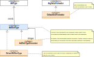
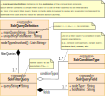
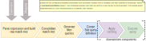

#### [Project Overview](../../../../../../../README.md)
----

# package solr

----

The package **solr** contains the basic classes for converting a **[CoreExpression](https://github.com/KarlEilebrecht/audlang-java-core/tree/main/src/main/java/de/calamanari/adl/irl/README.md)** into a Solr-query. 
Further details can be found in the sub-packages **[config](./config/README.md)** (configuration of mapping) and **[cnv](./cnv/README.md)** (converter and supplementary classes).

Audlang expressions are essentially *combinations of boolean conditions*. They are not fuzzy but deterministic. Solr on the other hand offers two kinds of queries, the main query (`q=`...) and filter queries (`fq=`...). The key difference is how they are executed. The main query can do all the fuzzy things for you and involves scoring. Filter queries are just filters. For deterministic conditional queries it is common practice to rely on filter queries and to set `q=*.*` as the main query to bypass unnecessary scoring.
Furthermore, whenever possible it is recommended to pass *multiple* filter queries to Solr to be *intersected*. In other words, if there is an *AND* with two *logically independent* branches, then each should be a separate filter query. This concept allows for **independent filter query result caching**.

To encourage the correct application of the native query strings generated by the converter, the [SolrQueryDefinition](./SolrQueryDefinition.java) keeps the key information together.
 * The main query (usually `q=*.*`) to pass to Solr.
 * The set of filter queries (`fq=...`) to send to Solr.
 * Besides the native query string, there is some meta data attached to each filter query. This information shall help estimate the cost of a filter query and its potential value for result caching. For example, a very simple strategy might be to cache only results of filter queries on the root document but no filter queries involving any nested documents. Or you could exclude any `frange`-queries.

It is noteworthy that the [SolrQueryDefinition](./SolrQueryDefinition.java) does not make any assumption about *what to query*. Other than in SQL you can run the same query to obtain counts, IDs, documents, and even documents including their nested documents. This can be controlled at execution time *independently from the query definition*. For testing and for reference a few common cases can be found in [DefaultQueryType](./DefaultQueryType.java). 

The [SolrQueryDefinition](./SolrQueryDefinition.java) also decouples the conversion process from the execution infrastructure. So, there is no library dependency to the Solr ecosystem or any specific Solr release. 

## Class overview

 * **[AdlSolrType](AdlSolrType.java)**: Extending [AdlType](https://github.com/KarlEilebrecht/audlang-java-core/tree/main/src/main/java/de/calamanari/adl/cnv/tps/README.md), AdlSqlTypes share common semantics with ADL-types (such as formatting) but add features related to Solr-types. By ***type decoration*** you can easily create custom type based on a given type with adjusted behavior.
    * :warning: There is **no native type casting** available for Solr because there is no concept of simply surrounding a Solr-field name with any magic to compare apples to oranges.
 * **[DefaultAdlSolrType](DefaultAdlSolrType.java)**: This enumeration represents common Solr types as [AdlSqlTypes](AdlSqlType.java). Usually, these types should be sufficient to map a given document landscape.
 * **[DefaultSolrFormatter](DefaultSolrFormatter.java)**: This enumeration contains the ArgValueFormatters for the [DefaultAdlSolrTypes](DefaultAdlSolrType.java). These formatters are used to include a value in a query compatible to the Solr type.
 * **[DefaultQueryType](DefaultQueryType.java)** is an enumeration of standard scenarios to build a query for. It only exists for testing and documentation purposes.
 * **[SolrFormatConstants](SolrFormatConstants.java)** and **[SolrFormatUtils](SolrFormatUtils.java)** contain constants and utility methods reused across the project to avoid duplication and increase code readability.
 * **[SolrQueryDefinition](SolrQueryDefinition.java)** is the outcome of a single conversion run (see explanation above).
   * **[SolrFilterQuery](SolrFilterQuery.java)** defines a single filter query to be executed.
   * **[SolrConditionType](SolrConditionType.java)** enumerates the principal native operations a filter query may require.
   * **[SolrQueryField](SolrQueryField.java)** is a Solr field name *virtually qualified* by a containing document. Technically, Solr fields are globally defined, independent from any specific document. [SolrQueryField](SolrQueryField.java) additionally identifies the node type.

## Further Reading
 * **[Configuration](./config/README.md)** - This package contains data structures and utilities to create a [SolrMappingConfig](./config/SolrMappingConfig.java) with the mapping to an underyling Solr schema.
 * **[Conversion](./cnv/README.md)** - In this package you find the extendable conversion framework with the [SolrExpressionConverter](./cnv/SolrExpressionConverter.java).
 * To get a better idea of the function of the classes in this package, please review related tests (e.g., [DefaultAdlSolrTypeTest](../../../../../../test/java/de/calamanari/adl/solr/DefaultAdlSqlTypeTest.java)). Some functionality has been abstracted for better reuse, see [EmbeddedSolrServerUtils](../../../../../../test/java/de/calamanari/adl/solr/EmbeddedSolrServerUtils.java) and [SolrTestBase](../../../../../../test/java/de/calamanari/adl/solr/SolrTestBase.java).

