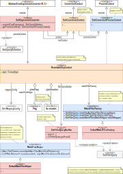
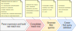
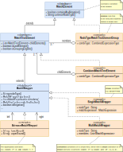
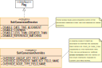

#### [Project Overview](../../../../../../../../README.md) | [package solr](../README.md)
----

# package cnv (Solr-conversion)

----

The package **cnv** contains the conversion classes to translate a given [CoreExpression](https://github.com/KarlEilebrecht/audlang-java-core/blob/main/src/main/java/de/calamanari/adl/irl/README.md) into as Solr filter query or a set of queries.

To convert an expression the converter *visits* all levels of the expression determining the correct combination of conditions. Because the [mapping](../config/SolrMappingConfig.java) to the underlying Solr schema has major impact on how the core expression's DAG can be translated into a Solr expression, the visitor first converts it into a tree of simple [MatchElements](MatchElement.java). This tree can then be consolidated and adjusted to create the optimal Solr query.

Finally, the collected filter queries get combined into a single [SolrQueryDefinition](../SolrQueryDefinition.java), the result of the conversion process.

The process state of a Solr-conversion has been separated into the **local context** (per expression level) and a **global context** with settings and variables, it also allows components in the process to pass information down the chain. The local context allows turning a leaf expression found in a CoreExpression into a [MatchWrapper](MatchWrapper.java) and to push it up to the parent (AND/OR) which then creates a [CombinedMatchTreeElement](CombinedMatchTreeElement.java). The process works *bottom-up* and creates the raw match tree.

The central supplementary features are the [MatchFilterFactory](MatchFilterFactory.java) and [MatchTreeHelper](MatchTreeHelper.java). They are implemented in a way that they can be extended or replaced if the existing conversion does not meet your requirements.

## Class overview

 * **[SolrConversionProcessContext](SolrConversionProcessContext.java)** is the global context for a single conversion execution. The **[ResettableScpContext](ResettableScpContext.java)** ensures that you can configure a converter once and run multiple conversions subsequently. State related to a previous run cannot accidentally leak into the next run. As the name states, the reset restores the settings that were provided initially.
 * **[SolrConversionContext](SolrConversionContext.java)** is an extended form of a ConversionContext (context of the given expression level with some additional features. Each [SolrConversionContext](SolrConversionContext.java) has a reference to the *global* [SolrConversionProcessContext](SolrConversionProcessContext.java). This gets injected into the level context by the converter whenever a level context instance is created.
 * **[SolrExpressionConverter](SolrExpressionConverter.java)** is the implementation of a general purpose Solr-converter. It *visits* the given core expression and leverages supplementary components from the context (e.g., [MatchFilterFactory](MatchFilterFactory.java) and [MatchTreeHelper](MatchTreeHelper.java)) to perform the conversion.
 * **[SolrFilterQueryBuilder](SolrFilterQueryBuilder.java)** allows the converter to create a Solr-compliant filter query string step by step. Besides providing the standard features (AND, OR, joins, etc.) this component manages nesting level, braces and indentation.
 * **[MatchFilterFactory](MatchFilterFactory.java)** centralizes the knowledge about the core Solr language features. Here we convert a particular condition into the syntax expected by Solr. See also [DefaultMatchFilterFactory](DefaultMatchFilterFactory.java).
 * **[MatchTreeHelper](MatchTreeHelper.java)**: This helper concentrates the logic for rebuilding the match tree to align it with the configured [mapping](../config/SolrMappingConfig.java). The idea is to avoid unnecessary joins by grouping elements. See also [DefaultMatchTreeHelper](DefaultMatchTreeHelper.java).
   
   * **[MatchElement](MatchElement.java)** is the most generic form of a simple or complex condition on Solr-field(s) from one or multiple documents.
   * **[MatchTreeElement](MatchTreeElement.java)** is either a single comparison or a combination (AND/OR) of sub-elements.
   * **[CombinedMatchTreeElement](CombinedMatchTreeElement.java)** is a combination of match tree elements (`AND` resp. `OR`).
   * **[NodeTypeMatchTreeElementGroup](NodeTypeMatchTreeElementGroup.java)** looks similar to [CombinedMatchTreeElement](CombinedMatchTreeElement.java) but *opaque* and strictly related to one particular node type. Later, this differentiation allows including all match conditions in a single join to the related type of document.
   * **[MatchWrapper](MatchWrapper.java)** is a condition on a field of a Solr document. It can be simple (e.g., `color:red`) or aggregated.
     * The **[MatchWrapperType](MatchWrapperType.java)** enumeration tells about the characteristics of a wrapper for later choosing the best Solr syntax.
   * **[MultiMatchWrapper](MultiMatchWrapper.java)** aggregates operations on the *same field* that either involve multiple values (e.g., `color any of (red, green, blue)`) or a simple combination of operations Solr can perform in a single operation (e.g., `count <= 3`).
   * **[BetweenMatchWrapper](BetweenMatchWrapper.java)** is a more sophisticated form of aggregation (e.g., `count between (10,20)`). There are cases were this form of aggregation would change the semantics of the query and will thus be avoided by intention. See also the documentation of [BetweenMatchWrapper](BetweenMatchWrapper.java) and [DefaultMatchTreeHelper](DefaultMatchTreeHelper.java).
  
 * **[SolrConversionDirective](SolrConversionDirective.java)** and **[SolrConversionOverrides](SolrConversionOverrides.java)** allow to control the converter's behavior with some global settings.
 
   
   
   For example, if you don't like the automatic date adjustment then you can set the corresponding directive [SolrConversionDirective.**DISABLE_DATE_TIME_ALIGNMENT**](SolrConversionDirective.java).

## Further Reading
 * **Unit tests**: In the corresponding test package you can find tests related to the classes in this package, for example:   
   * [SingleMatchWrapperTest](../../../../../../../test/java/de/calamanari/adl/solr/cnv/SingleMatchWrapperTest.java)
   * [MultiMatchWrapperTest](../../../../../../../test/java/de/calamanari/adl/solr/cnv/MultiMatchWrapperTest.java)
   * [DefaultMatchFilterFactoryTest](../../../../../../../test/java/de/calamanari/adl/solr/cnv/DefaultMatchFilterFactoryTest.java)  
   * [DefaultMatchTreeHelperTest](../../../../../../../test/java/de/calamanari/adl/solr/cnv/DefaultMatchTreeHelperTest.java)
   * Dry mappings (no execution) are defined in [ConversionTestUtils](../../../../../../../test/java/de/calamanari/adl/solr/cnv/ConversionTestUtils.java).

 * **Embedded Solr Tests**: This project uses an embedded Solr instance to ensure the generated Solr expressions are executable.
   * [SolrExpressionConverterTest](../../../../../../../test/java/de/calamanari/adl/solr/cnv/SolrExpressionConverterTest.java)  
   * [SolrExpressionConverterComplexTest](../../../../../../../test/java/de/calamanari/adl/solr/cnv/SolrExpressionConverterComplexTest.java)  
   * [EmbeddedSolrServerUtils](../../../../../../../test/java/de/calamanari/adl/solr/EmbeddedSolrServerUtils.java)
   * Test data setup: 
     * [audlang-data-hybrid.json](../../../../../../../test/resources/solr/exampledocs/audlang-data-hybrid.json) with [managed-schema.xml](../../../../../../../test/resources/solr/configsets/audlang/conf/managed-schema.xml).
     * The mapping can be found in [EmbeddedSolrServerUtils](../../../../../../../test/java/de/calamanari/adl/solr/EmbeddedSolrServerUtils.java).

