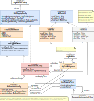

#### [Project Overview](../../../../../../../../README.md) |  [package solr](../README.md)
----

# package config (Mapping Configuration)

----

The package **config** contains all the features to setup a [SolrMappingConfig](SolrMappingConfig.java) which connects the argument names used in an Expression to an underlying Solr schema.

The mapping approach supports single and multi-document data. Thus, it fits a scenario where all attributes are organized perfectly side-by-side in a single large document but the idea of having a central document with nested or dependent sub-documents in your Solr-schema.

There are a few preliminary constraints:
 * There must be a central document per individual. These are the records any queries will work on.
 * A unique key field is mandatory, by default named `id`.
 * Every document (main, nested, or dependent) must carry a field indicating the type of document, by default named `node_type` (String).
 * Dependent documents (sub documents not nested) must carry the a field with the foreign key (id of the main document), by default named `main_id`. This allows joining from the main document to the dependent document.

:bulb: In this documentation, the term **node type** is used interchangeably with **document type**. In either case we talk about the class of documents uniquely identified by the `node_type`.

Because the setup of a mapping can be tedious the central classes have **fluent APIs** to keep configurations short and easy to read.

## Class overview

 * **[SolrMappingConfig](SolrMappingConfig.java)**: This interface describes the configuration of a scenario with a single main document and optional sub documents.
 * **[NodeTypeMetaInfo](NodeTypeMetaInfo.java)** describes the key elements and characteristics of certain type of document, namely its nature and potential document filters.
 * **[SolrDocumentNature](SolrDocumentNature.java)**: This enumeration defines the kinds of documents the system supports. See also [:point_right: About the nature of documents and fields](../../../../../../../../doc/document-field-nature.md).
 * **[MainDocumentConfig](MainDocumentConfig.java)** is an implementation of [SolrMappingConfig](SolrMappingConfig.java) with the ability to map fields of this document and optionally add sub configurations with mappings of nested or dependent documents. 
   * There is a built-in consistency check that the same attribute (argName) cannot be mapped to multiple columns (across all configs).
   * Should any auto-mapping policy apply to an explicitly mapped argName (*field stealing*), an error will be thrown at configuration time.
   * There is a defined *mapping order* when multiple configurations have an [AutoMappingPolicy](AutoMappingPolicy.java) attached. In this case, first the sub-configs will be *probed* in order of configuration before finally considering the main configuration.
 * **[SubDocumentConfig](SubDocumentConfig.java)** contains mappings to fields of a nested or dependent document. It lives inside a [MainDocumentConfig](MainDocumentConfig.java).
 * **[AdlSolrField](AdlSolrField.java)** is the common interface of all configured fields in a [SolrMappingConfig](SolrMappingConfig.java), [DataFields](DataField.java) and [FilterField](FilterField.java).
 * **[DataField](DataField.java)** defines a Solr-field that holds attribute values, e.g., "red" for the argName "color" plus the field's type. The [AdlSolrType](../AdlSolrType.java) of the data field decides about the way the conditions from a query will be expressed in a Solr query. The same field can occur multiple times within the same configuration, mapped to different argNames.
 * **[FilterField](FilterField.java)** is a field that does not contain any data related to argNames but acts as an *additional constraint* on a document.
   * Filter columns can be defined per document (node type). *Every* query involving the related document will automatically include the filter field condition. E.g., your table has a `TENANT` field, then you could define a filter field condition with the filter value `${tenant}` and put the `tenant`-variable in the process context (e.g., `tenant=4711`). This way only data related to tenant 4711 can be queried from that document.
   * [FilterFields](FilterField.java) are regular [AdlSolrFields](AdlSolrField.java) with an [AdlSolrType](AdlSolrType.java) underneath. Thus, the final filter value of type STRING must be compatible to that destination type. For example, a common mistake is defining a filter field of type [DefaultAdlSolrType.SOLR_BOOLEAN](../DefaultAdlSolrType.java) with the filter value "TRUE". The correct setting is **"1"** (see also [Type Conventions](https://github.com/KarlEilebrecht/audlang-spec/blob/main/doc/AudienceDefinitionLanguageSpecification.md#2-type-conventions))
 * **[AutoMappingPolicy](AutoMappingPolicy.java)**: Sometimes (e.g. for testing) it is way easier to define a mapping based on rules rather than connecting a logical data model attribute by attribute to fields from a Solr schema. An [AutoMappingPolicy](AutoMappingPolicy.java) analyzes an argName *at runtime* to map it to the correct destination fields. If there are automapping policies defined for multiple fields, then the *probing* of the policies happens in the order of configuration (first wins). The [AutoMappingPolicies](AutoMappingPolicy.java) of sub-documents *take precedence* over the policies defined in the main configuration. This makes it easier to probe special patterns (auto-mapped to sub-document) *before* common patterns (auto-mapped to main document). Auto-mapping aligns with Solr's naming convention for dynamic fields. This way it is easy to map argNames to Solr field names and leave the type resolution entirely to the framework (see [ConventionUtils](ConventionUtils.java)).
 * **[DefaultAutoMappingPolicy](DefaultAutoMappingPolicy.java)** is the implementation that implicitly backs most of all auto-mapping. Whenever an argName only has to be parsed to find the field name, under the hood a [DefaultAutoMappingPolicy](DefaultAutoMappingPolicy.java) will be created when you use the fluent API to build the configuration.
 * **[ArgFieldAssignment](ArgFieldAssignment.java)** assigns an argName uniquely to a field in a document. While it is not possible to map the same argName to multiple fields, it is indeed legal (and sometimes required) to map multiple argNames to the same field. In case of auto-mapping these assignments happen dynamically because initially we don't know all argNames.

## Further Reading

 * **Unit tests**: In the corresponding test package you can find tests related to the classes in this package, e.g.:   
   * [DataFieldTest](../../../../../../../test/java/de/calamanari/adl/solr/config/DataFieldTest.java)
   * [FilterFieldTest](../../../../../../../test/java/de/calamanari/adl/solr/config/FilterFieldTest.java)
   * [MainDocumentConfigTest](../../../../../../../test/java/de/calamanari/adl/solr/config/MainDocumentConfigTest.java)
   * [SubDocumentConfigTest](../../../../../../../test/java/de/calamanari/adl/solr/config/SubDocumentConfigTest.java)
   * [DefaultAutoMappingPolicyTest](../../../../../../../test/java/de/calamanari/adl/solr/config/DefaultAutoMappingPolicyTest.java)
 * **[ConversionTestUtils](../../../../../../../test/java/de/calamanari/adl/solr/cnv/ConversionTestUtils.java)** contains the common *dry* mapping for testing without execution
 * **[EmbeddedSolrServerUtils](../../../../../../../test/java/de/calamanari/adl/solr/EmbeddedSolrServerUtils.java)** contains the mapping for the tests to be executed on the embedded Solr (see also [managed-schema.xml](../../../../../../../test/resources/solr/configsets/audlang/conf/managed-schema.xml) and [audlang-data-hybrid.json](../../../../../../../test/resources/solr/exampledocs/audlang-data-hybrid.json)).
 * **[About the nature of documents and fields](../../../../../../../../doc/document-field-nature.md)**
 * **[Mapping a document landscape](../../../../../../../../doc/mapping.md)**

